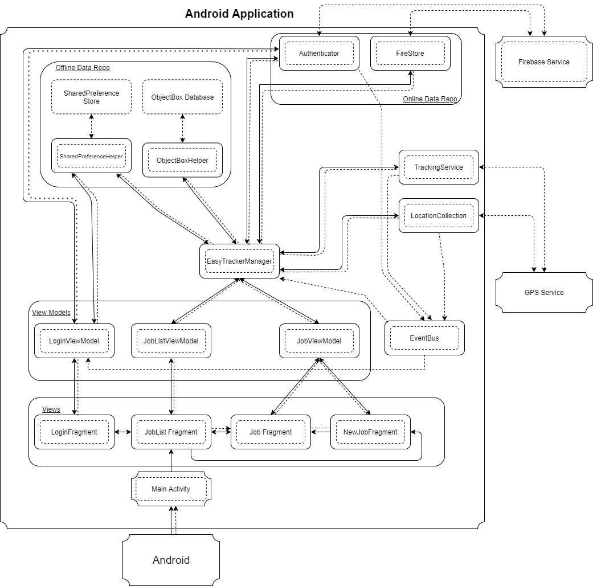
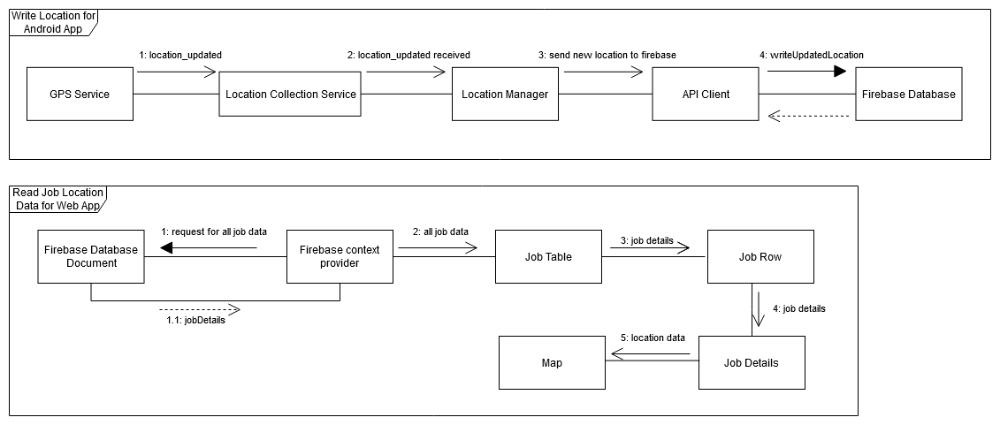

### What is this repository for? ###

The EasyTracker application system aims to create a revolutionary modern and efficient method for business owners to track and manage multiple contractors or logistic drivers’ physical location. With this application, the contractor needs to start the job right timely. This is ideal for small SME when there are both internal/external contractors needed to track for live location and record logging. The end goal of the solution is to help companies improve their efficiency. 

## Easy Tracker Android ##
This repository holds the mobile component of the system. Built using Android. This application 

* **Live GPS Tracking of Contractors/Logistic Transport islandwide**
* **Contractor Details Logging for Records**
* **Contractor Work Start and End Session**
* **Users create accounts and are authenticated using Google Firebase**
* **Keep track and visualise past job details**

### [UML] Architecture Diagram ###

Easy Tracker Android follows the conventional [MVVM Architecture](https://developer.android.com/jetpack/guide) highlighted by Google
### [UML ] Communication Diagram ###

### Owner ###

* [Malcom](https://www.linkedin.com/in/malcom-teh) -  Android Developer
